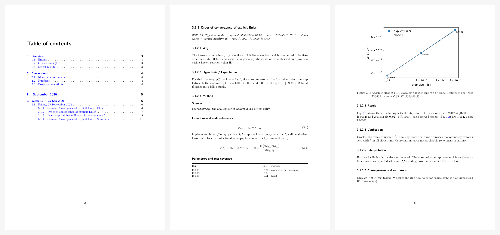
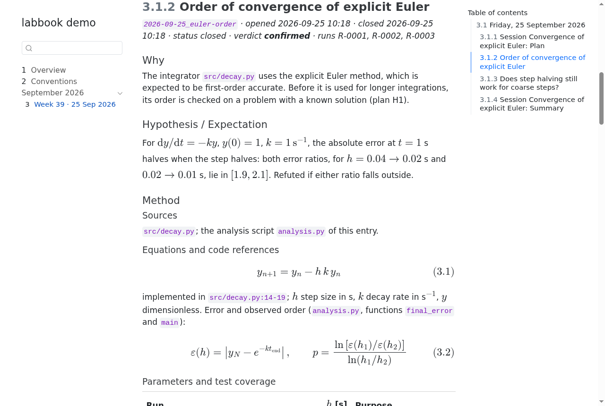
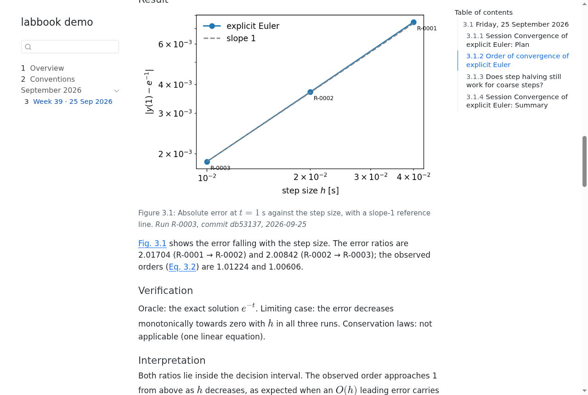
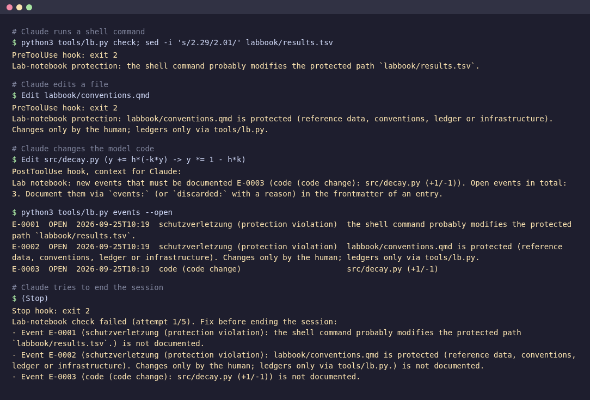
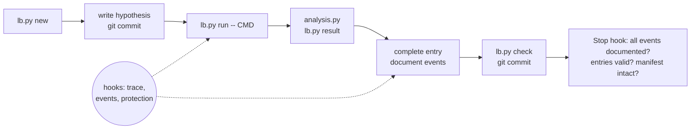

# labbook

**A preregistered, tamper-evident lab notebook for computational experiments run with Claude Code.**

When an AI assistant runs your simulations, debugs your solver or works through a parameter study
overnight, the question the next morning is not only *what came out* but *can I trust how it got
there*: Was the hypothesis stated before the result was known? Which exact code and inputs produced
this number? Did a test get relaxed, a reference file edited, a failing run quietly dropped?

labbook answers these questions mechanically. It turns a git repository into a Quarto lab notebook
and uses Claude Code hooks to record every tool call, to flag changes that matter and to stop the
session from ending while they are undocumented.

- **Preregistration.** `lb.py run` refuses to start a run unless the entry's hypothesis is
  committed. Every run gets an ID (`R-0001`), a directory and a provenance record: command,
  parameters, SHA-256 of inputs and outputs, git commit, and the diff if the tree was dirty.
- **Numbers from a ledger, not from prose.** Metrics go to `results.tsv` via `lb.py result`;
  entries cite them with shortcodes (``), so a number in the text
  always matches the ledger.
- **Events.** Hooks turn relevant actions into events: code changes (ignoring comments and whitespace),
  edits to tests or parameter files, test status changes, build failures, runs, blocked writes. Each
  one must be documented in an entry, or discarded with a stated reason.
- **Protection.** A `PreToolUse` hook blocks edits of protected paths: the ledgers, the notebook
  infrastructure and your reference data. A SHA-256 manifest written by the human is verified at
  every stop. Closed entries are immutable; corrections are new entries.
- **Audit.** An auditor agent cross-checks a finished session: plan against execution, narrative
  against trace, numbers in the text against the ledger, discarded events against their reasons.
- **Timestamps.** Entries record when they were opened and closed (`lb.py new`, `lb.py close`).
- **A book.** `lb.py book` renders all entries and session documents as a PDF or HTML book organised
  by month › week › day.

It is plain Python (standard library), git and Quarto. It was developed for the KOSMA-τ
photon-dominated-region code (Fortran, astrochemistry), where it has documented about 200 model runs
in 70 entries. Nothing in it is specific to that code.

## What it looks like

The images come from the demo below: a short session with a plan, two preregistered hypotheses
about the explicit Euler method (one confirmed, one refuted), five runs and a session summary. The
rendered book is in [`docs/example/labbook-demo.pdf`](docs/example/labbook-demo.pdf) (12 pages).

**The book** (PDF): table of contents by month › week › day, an entry with its metadata line
(ID, opened/closed, verdict, runs), and equations tied to code lines. The figure comes from the
entry's `analysis.py`, and the caption ends with the run provenance. Every number in the text is a
shortcode that reads the ledger.



**The same book as HTML**, searchable, with the day's entries in the sidebar:





**The hooks at work.** This is real hook output for simulated tool calls in the demo project. A
chained shell command that would edit the ledger and a direct edit of the conventions are both
blocked. A change to the model code becomes an event. The session cannot end until every event is
documented in an entry:



## How a session looks



An entry has fixed sections: Why · Hypothesis / Expectation · Method (with equations tied to
`file:line`) · Result (observation only) · Verification · Interpretation · Consequences · Failed
attempts · Deviations from plan. For unattended work, `lb.py session start` creates a plan with goal,
hypotheses, scope of action, stop criteria and a test oracle, which must be committed before the
first run.

## Try it in two minutes

```bash
git clone https://github.com/markusroellig/labbook
labbook/examples/demo/run_demo.sh          # builds a throw-away project in a temp directory
```

The demo installs labbook into a toy project and runs a small session on the question "is explicit
Euler really first order, and down to which step size?". It starts with a committed plan. It shows a
run refused before its hypothesis exists, then preregistration, five runs through the wrapper, an
analysis that draws a figure and writes metrics to the ledger, two entries closed with
`lb.py close` (one confirmed, one refuted), the session summary, and the HTML and PDF books
if Quarto is installed. It needs matplotlib. It runs without Claude Code; in a real session the
assistant does the same steps, and the hooks add the trace, the events and the protection.

## Installation

Requirements: Python ≥ 3.11, git, Linux or macOS, Claude Code for the hooks,
[Quarto](https://quarto.org) (with a TeX engine for PDF) for rendering. Without Quarto, set
`[check] render = "off"`.

```bash
./install.sh /path/to/project                   # or: --notebook notes  for another directory name
cd /path/to/project
$EDITOR .claude/labbook.toml                    # protected reference data, code patterns, test commands
$EDITOR labbook/conventions.qmd                 # units, symbols, what counts as a passing test
echo '@CLAUDE.labbook.md' >> CLAUDE.md          # load the rules in every session
python3 tools/lb.py preflight
python3 tools/lb.py protect                     # human only: seal the protected files
git add -A && git commit -m "labbook installed"
```

`install.sh` never overwrites existing files. It merges the hook registration into an existing
`.claude/settings.json` (keeping a `.bak`) and installs:

| installed at | what |
|---|---|
| `tools/lb.py` | the command-line tool |
| `.claude/hooks/labhook.py`, `lb_common.py` | the hooks and their library |
| `.claude/labbook.toml` | configuration ([annotated example](labbook.toml.example)) |
| `.claude/skills/labbook/` | the working method as a skill (loaded before experiments) |
| `.claude/agents/labbook-auditor.md` | the independent session auditor |
| `CLAUDE.labbook.md` | the binding rules, included from `CLAUDE.md` |
| `labbook/` | the notebook skeleton: Quarto config, shortcodes, templates, conventions |
| `Makefile.labbook` | optional make targets (`include Makefile.labbook`) |

Set `cleanupPeriodDays` in `~/.claude/settings.json` to a large value (e.g. 3650). Otherwise Claude
Code deletes session transcripts after 30 days, and the audit trail loses its source (`preflight`
checks this).

## Commands

| | |
|---|---|
| `lb.py new <slug> --title "…"` | new entry |
| `lb.py run --entry <id> [--param k=v] [--input F] [--output GLOB] -- CMD …` | run with provenance |
| `lb.py result R-0001 --metric M --value X --status keep\|discard\|info --description "…"` | metric into the ledger |
| `lb.py close <id> --verdict confirmed\|refuted\|…` | close an entry (status, verdict, `closed` timestamp) |
| `lb.py check [--all]` | what the Stop hook checks |
| `lb.py events --open` | undocumented events |
| `lb.py session start <slug>` / `session end` | autonomous session with plan and summary |
| `lb.py book [--format html]` | render the book (month › week › day › entry) |
| `lb.py preflight` | readiness for an unattended session |
| `lb.py protect` | rewrite the protection manifest (human only) |

Full reference (configuration keys, file formats, shortcodes, hooks): [docs/REFERENCE.md](docs/REFERENCE.md).

## What the protection is and is not

The protection guards against careless or pressured changes: an assistant "fixing" a failing test by
relaxing its tolerance, editing a reference file, or rewriting the ledger. It is not a sandbox. Edits
through Claude Code's file tools are blocked reliably. Shell commands are checked heuristically, by
looking for write operations next to protected path names, so a sufficiently indirect command gets
through. What gets through is caught afterwards: the Stop hook verifies the SHA-256 manifest and the
append-only ledgers against git and refuses to end the session, and the trace keeps the command for
the auditor. If you need hard guarantees, add OS-level permissions or run the assistant in a
container with the reference data mounted read-only.

The heuristic also produces false positives: a harmless command that names a protected path together
with `cp`, `mv` or `>` is blocked, and the block itself is recorded as an event. Run the tool
(`lb.py`) in its own shell call, and name protected files only where you read them.

## Working with several machines or branches

The notebook directory can be a separate git repository cloned into the project and ignored by it.
One notebook then serves every code branch and machine, and entries are committed inside the notebook
directory while code provenance still comes from the project repository. Give each machine its own run-ID range
(`[run] id_range = "1-999"` here, `LB_ID_RANGE=1000-1999` there).

## Upgrading and uninstalling

- `./install.sh --upgrade /path/to/project` replaces the tool, the hooks and the shortcode extension.
  It leaves configuration, templates, conventions, skill and agent alone; compare those by hand. The
  maintainer then re-runs `lb.py protect`.
- Notebooks and configurations of 0.1, with German names (`laborbuch/`, `[schutz] geschuetzt`,
  `eintraege/`, …), keep working unchanged; see the compatibility table in the reference.
- To uninstall, remove the hook entries from `.claude/settings.json` and delete the installed files.
  The notebook stays as plain Markdown, TSV and JSON.

## Licence and citation

MIT, see [LICENSE](LICENSE). Developed 2026 by Markus Röllig (Physikalischer Verein / University of
Cologne) in the KOSMA-τ project. Issues and pull requests are welcome; see
[CONTRIBUTING.md](CONTRIBUTING.md).
